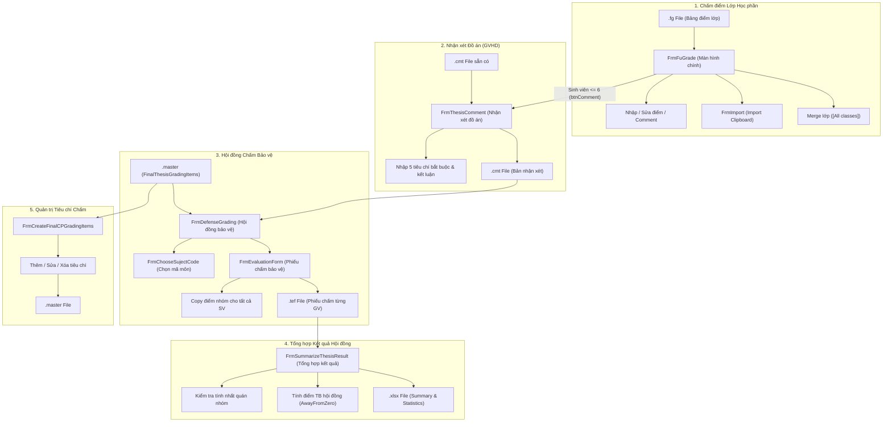
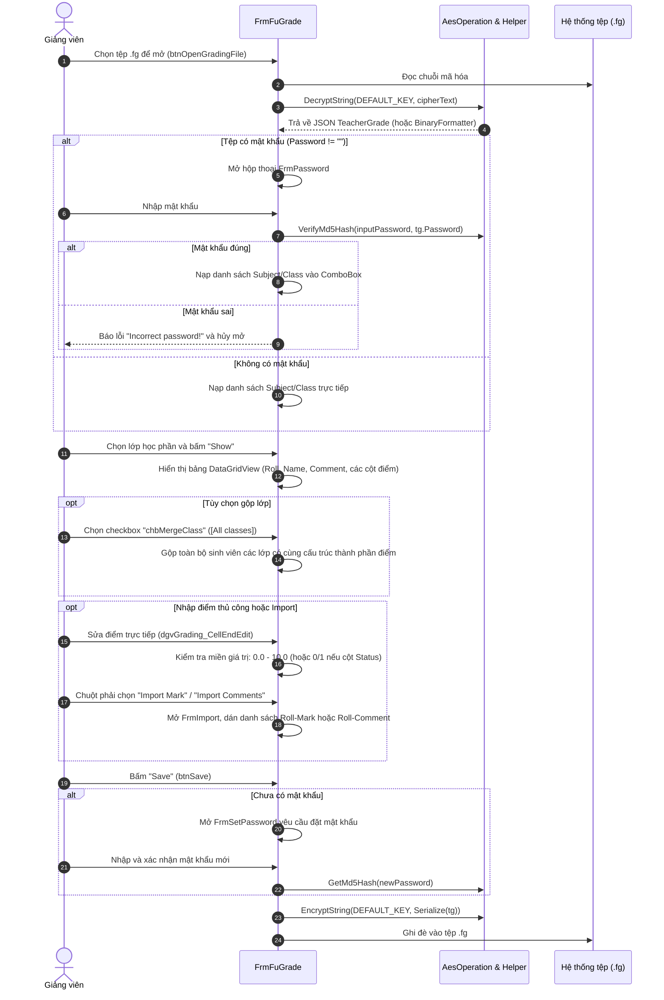
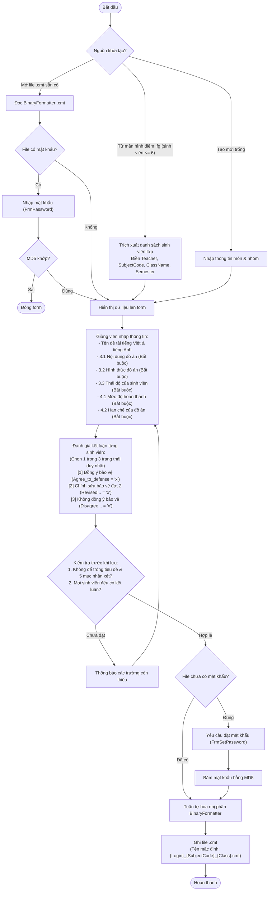
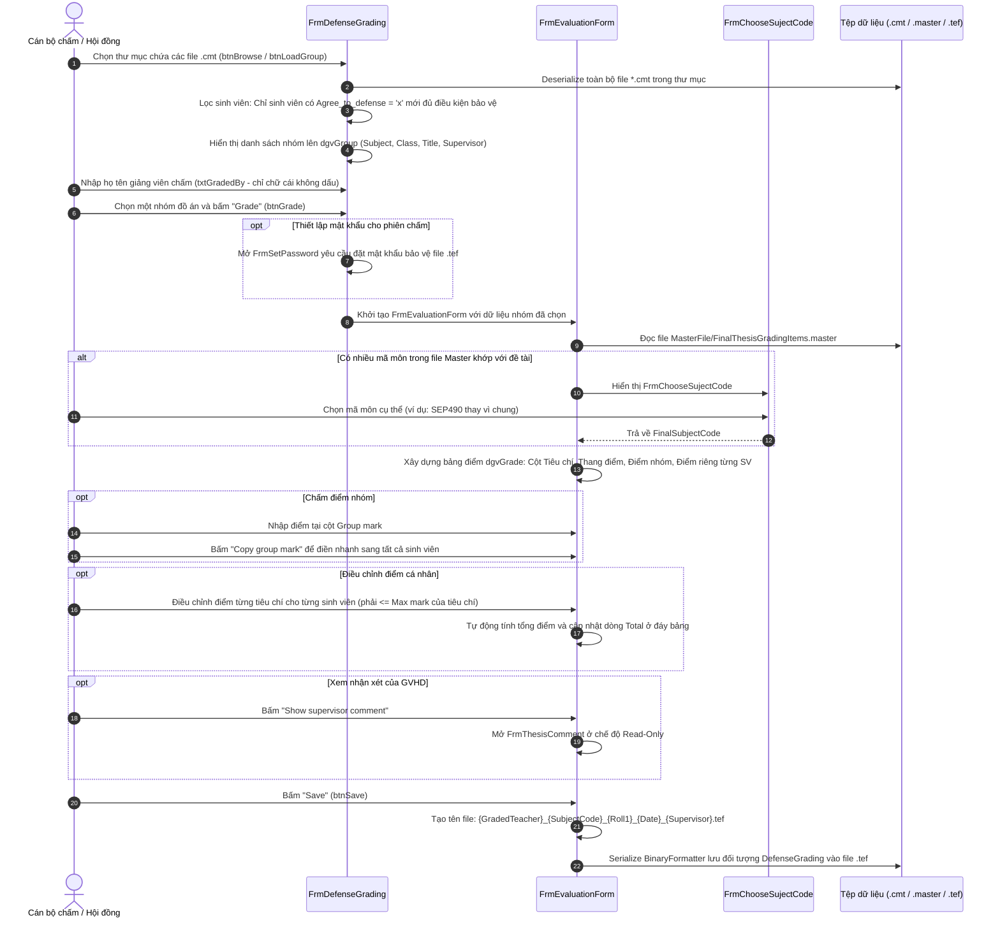
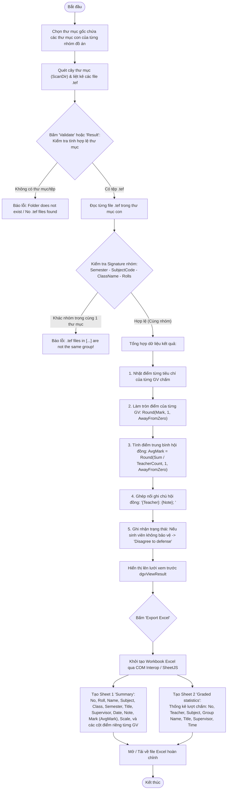

# Sơ đồ Luồng Nghiệp vụ & Kiến trúc Hệ thống FuGrade

Tài liệu mô tả chi tiết toàn bộ các luồng nghiệp vụ (workflows), kiến trúc hệ thống và luồng dữ liệu liên thông của hệ thống quản lý điểm FuGrade từ phiên bản C# WinForms gốc sang ứng dụng Web.

---

## 1. Kiến trúc Tổng thể & Mối liên hệ Giữa các Module

Trong phiên bản C# WinForms cũ (`FuGrade.exe` và `FuGradeLib.dll`), hệ thống được tổ chức thành 5 quy trình chính hoạt động xoay quanh 4 định dạng file nhị phân/mã hóa:
- `.fg`: Bảng điểm lớp học phần (AES-CBC encrypted JSON hoặc BinaryFormatter).
- `.cmt`: Bản nhận xét đồ án tốt nghiệp của Giảng viên hướng dẫn (BinaryFormatter `ThesisComment`).
- `.tef`: Phiếu chấm điểm bảo vệ đồ án của từng thành viên hội đồng (BinaryFormatter `DefenseGrading`).
- `.master`: Danh mục tiêu chí chấm đồ án theo ngành/chuyên ngành (BinaryFormatter `List<FinalThesisGradingItem>`).
- `.xlsx`: Báo cáo tổng hợp kết quả bảo vệ đồ án xuất ra Excel.



---

## 2. Luồng 1: Quản lý Bảng điểm Lớp Học phần (`.fg`)

Mục đích: Cho phép giảng viên mở file điểm lớp `.fg`, xác thực mật khẩu, xem danh sách sinh viên, nhập điểm các thành phần, import điểm từ văn bản, và lưu lại file.



---

## 3. Luồng 2: Viết Nhận xét Đồ án Tốt nghiệp (`.cmt`)

Mục đích: Giảng viên hướng dẫn viết đánh giá chi tiết cho nhóm đồ án (tối đa 6 sinh viên) và đưa ra kết luận bảo vệ cho từng thành viên.



---

## 4. Luồng 3: Hội đồng Chấm Bảo vệ Đồ án (`.tef`)

Mục đích: Thành viên hội đồng nạp danh sách các nhóm đồ án từ các file `.cmt`, chọn tiêu chí từ `.master`, và chấm điểm từng sinh viên.



---

## 5. Luồng 4: Tổng hợp Kết quả Bảo vệ Đồ án & Xuất Excel (`.xlsx`)

Mục đích: Giáo vụ/Chủ nhiệm hội đồng nạp tất cả các file `.tef` của các hội đồng, kiểm tra tính toàn vẹn và xuất bảng điểm tổng hợp ra Excel.



---

## 6. Luồng 5: Quản lý Tiêu chí Chấm Đồ án (`.master`)

Mục đích: Cho phép người quản trị cập nhật barem điểm, tiêu chí chấm và thang điểm tối đa cho từng môn tốt nghiệp.

```mermaid
sequenceDiagram
    autonumber
    actor Admin as Quản trị viên
    participant UI as FrmCreateFinalCPGradingItems
    participant File as MasterFile/FinalThesisGradingItems.master

    Admin->>UI: Mở màn hình quản trị tiêu chí
    UI->>File: Đọc danh sách List<FinalThesisGradingItem>
    UI->>UI: Nạp danh sách Subject Code vào ListBox (lstAvailable)

    Admin->>UI: Chọn mã môn (SubjectCode)
    UI->>UI: Lọc và hiển thị các tiêu chí của môn đó lên dgvGradingItems
    UI->>UI: Tính tổng thang điểm (Total Scale) của môn

    alt Thêm tiêu chí mới
        Admin->>UI: Nhập SubjectCode, Major, Minor, ItemGroup, GradingItem, Scale
        Admin->>UI: Bấm Save (btnSave)
        UI->>UI: Kiểm tra: Không trùng GradingItem trong cùng mã môn; Scale > 0
        UI->>UI: Thêm vào danh sách listFTGI
    else Chỉnh sửa tiêu chí
        Admin->>UI: Chọn dòng tiêu chí cần sửa, thay đổi thông tin
        Admin->>UI: Bấm Save
        UI->>UI: Cập nhật thông tin trong listFTGI
    end

    UI->>File: BinaryFormatter Serialize ghi lại toàn bộ danh sách vào file .master
    UI-->>Admin: Hiển thị bảng tiêu chí đã được cập nhật
```

---

## 7. Sơ đồ Luồng Dữ liệu Liên thông Giữa các Tệp (Data Lineage)

```mermaid
flowchart LR
    subgraph InputFiles["Tệp Đầu vào"]
        FG[".fg (TeacherGrade)<br/>AES-CBC Encrypted"]
        MASTER[".master (Criteria)<br/>BinaryFormatter"]
    end

    subgraph Step1["Bước 1: Chấm điểm Lớp"]
        FG --> |"Trích xuất sinh viên"| FG_Process["Chấm điểm học phần<br/>& Xác định nhóm đồ án"]
    end

    subgraph Step2["Bước 2: Nhận xét GVHD"]
        FG_Process --> |"Export / Tạo mới"| CMT[".cmt (ThesisComment)<br/>BinaryFormatter"]
    end

    subgraph Step3["Bước 3: Hội đồng Bảo vệ"]
        CMT --> |"Nhúng SupervisorComment"| TEF_Process["Hội đồng chấm điểm<br/>(Điểm nhóm + Điểm riêng)"]
        MASTER --> |"Barem điểm & tiêu chí"| TEF_Process
        TEF_Process --> |"Từng thành viên xuất file"| TEF[".tef (DefenseGrading)<br/>BinaryFormatter"]
    end

    subgraph Step4["Bước 4: Tổng hợp"]
        TEF --> |"Tập hợp nhiều file .tef"| SUM_Process["Tổng hợp & Làm tròn điểm<br/>(AwayFromZero)"]
        SUM_Process --> XLSX[".xlsx (Báo cáo tốt nghiệp)<br/>2 Sheets: Summary & Statistics"]
    end
```


